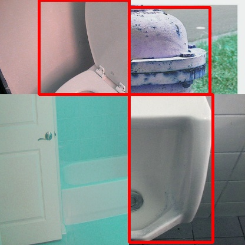
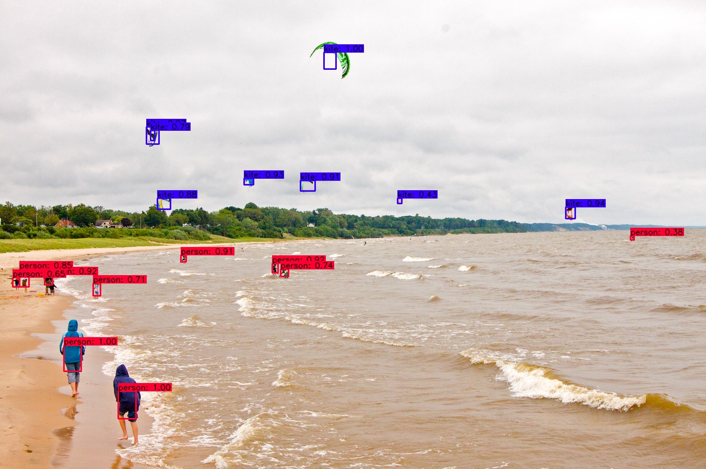

# Yolo v4-tensorflow
Tensorflow implementation for Yolo v4

Dependencies:-

tensorflow2.x
opencv


# Mosaic data argumentation
data.py added Mosaic data argumentation, for imagenet classfication and object detection

this mosaic data argumentation is not exactly the same as original yolov4 implementation, but much close to that and I will work on that

<p align="center"></p>

<p align="center"></p>


# Inference
some postprocess code borrowed [here](https://github.com/hunglc007/tensorflow-yolov4-tflite) and will update own version

run:
```bash
python detect.py --image ./kite.jpg
```
demo:
<p align="center"></p>

